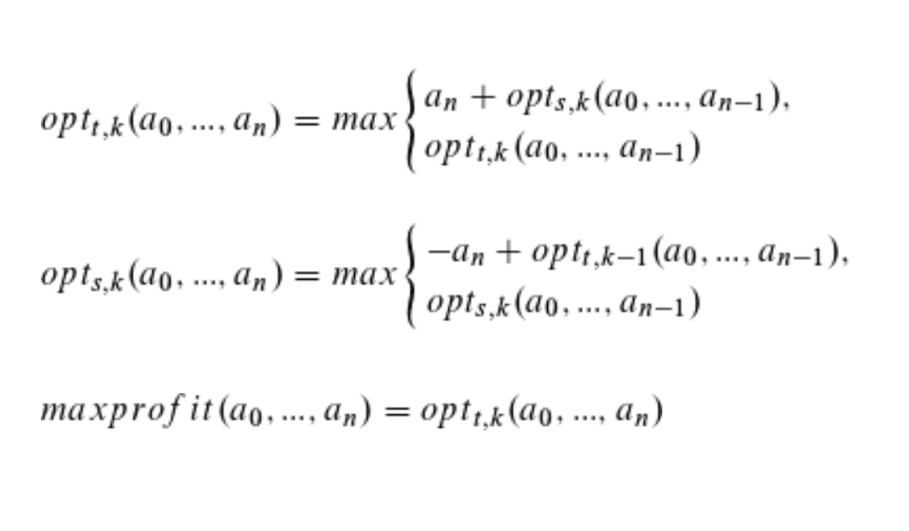

## Dynamic-Programming solution of the Maximum Profit Problem 

Input: Given an array of n integers representing a price of something over a time period and an integer k.

Output: What is the maximum profit you can make by buying and selling at most k times?

## Dynamic programming approach


Running time: O(k*n)

Space usage: O(n)

## Examples

```python
a = [20, 580, 420, 900]
max_profit_dp(a, 0) // 0
max_profit_dp(a, 1) // 880
max_profit_dp(a, 2) // 1440
```

```python
a = [10, 22, 5, 75, 65, 80]
max_profit_dp(a, 0) // 0
max_profit_dp(a, 1) // 75
max_profit_dp(a, 2) // 87
max_profit_dp(a, 3) // 97
```